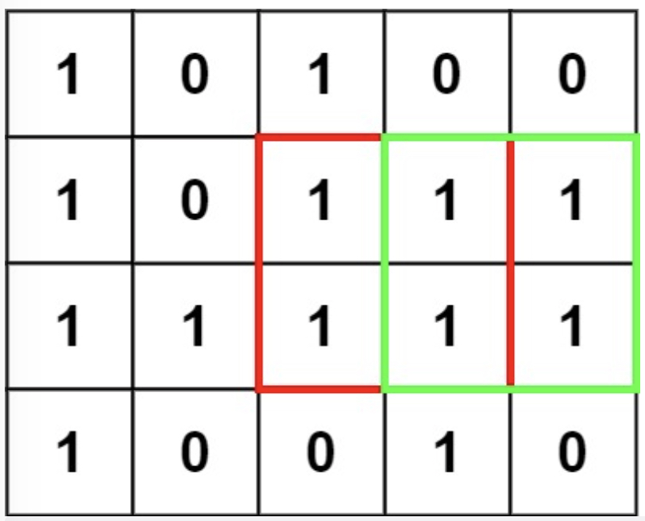

[TOC]

# 子数组/子序列

## [53. 最大子数组和](https://leetcode.cn/problems/maximum-subarray/)

给你一个整数数组 `nums` ，请你找出一个具有最大和的连续子数组（子数组最少包含一个元素），返回其最大和。

**子数组** 是数组中的一个连续部分。

```cpp
class Solution {
public:
    int maxSubArray(vector<int>& nums) {
        int n = nums.size();
        int dp_i_1, dp_i;
        //dp[i]表示以nums[i]结尾的最大子数组和
        dp_i_1 = nums[0];
        int ans = dp_i_1;
        for(int i = 1; i < n; i++){
            dp_i = max(nums[i], dp_i_1 + nums[i]);
            dp_i_1 = dp_i;
            ans = max(ans, dp_i);
        }
        return ans;
    }
};
```

## [152. 乘积最大子数组](https://leetcode.cn/problems/maximum-product-subarray/)

给你一个整数数组 nums ，请你找出数组中乘积最大的非空连续子数组（该子数组中至少包含一个数字），并返回该子数组所对应的乘积。

测试用例的答案是一个 32-位 整数。

子数组 是数组的连续子序列。

**示例 1:**

```
输入: nums = [2,3,-2,4]
输出: 6
解释: 子数组 [2,3] 有最大乘积 6。
```

代码：

```cpp
class Solution {
public:
     //这道题跟最大子数组和的区别就是,需要考虑正负数的情况,负负会得正
     //因此需要记录上一个状态的max和min，将max和min都乘一下，取最大和最小即可
    int maxProduct(vector<int>& nums) {
        int dp_max = nums[0], dp_min = nums[0], ans = nums[0];
        for (int i = 1; i < nums.size(); ++i) {
            int mx = dp_max, mn = dp_min;
            dp_max = max(mx * nums[i], max(nums[i], mn * nums[i]));
            dp_min = min(mn * nums[i], min(nums[i], mx * nums[i]));
            ans = max(dp_max, ans);
        }
        return ans;
    }
};
```

## [300. 最长递增子序列](https://leetcode.cn/problems/longest-increasing-subsequence/)

给你一个整数数组 nums ，找到其中最长严格递增子序列的长度。

子序列 是由数组派生而来的序列，删除（或不删除）数组中的元素而不改变其余元素的顺序。例如，[3,6,2,7] 是数组 [0,3,1,6,2,2,7] 的子序列。


示例 1：

输入：nums = [10,9,2,5,3,7,101,18]
输出：4
解释：最长递增子序列是 [2,3,7,101]，因此长度为 4 。

来源：力扣（LeetCode）
链接：https://leetcode.cn/problems/longest-increasing-subsequence
著作权归领扣网络所有。商业转载请联系官方授权，非商业转载请注明出处。

代码：

```cpp
class Solution {
public:
    int lengthOfLIS(vector<int>& nums) {
        int n = nums.size();
        vector<int> dp(n,1);//所有的元素初始化应该为1，因为每个元素都可能是子序列的起点，作为初始值
        //以nums[i]结尾的最大子序列长度
        for(int i = 0; i < n; i++){
            for(int j = 0; j < i; j++){
                if(nums[i] > nums[j])
                    dp[i] = max(dp[i], dp[j] + 1);
            }
        }
        int ans = 0;
        for(int i = 0; i < n; i++)
            ans = max(ans, dp[i]);

        return ans;
    }
};
```


## [139. 单词拆分](https://leetcode.cn/problems/word-break/)

给你一个字符串 s 和一个字符串列表 wordDict 作为字典。请你判断是否可以利用字典中出现的单词拼接出 s 。

注意：不要求字典中出现的单词全部都使用，并且字典中的单词可以重复使用。

示例 1：

输入: s = "leetcode", wordDict = ["leet", "code"]
输出: true
解释: 返回 true 因为 "leetcode" 可以由 "leet" 和 "code" 拼接成。

代码：

```cpp
class Solution {
public:
    bool wordBreak(string s, vector<string>& wordDict) {
        auto wordDictSet = unordered_set <string> ();
        for (auto word: wordDict) {
            wordDictSet.insert(word);
        }
        //dp[i]表示前i个字符，s[0...i-1]能否被拆分成多个worddict中的字符串
        auto dp = vector <bool> (s.size() + 1);
        //base case
        dp[0] = true;
        for (int i = 1; i <= s.size(); ++i) {
            for (int j = 0; j < i; ++j) {
                //状态转移方程dp[i] = dp[j] && check(s[j...i-1])
                if (dp[j] && wordDictSet.find(s.substr(j, i - j)) != wordDictSet.end()) {
                    dp[i] = true;
                    break;
                }
            }
        }
        return dp[s.size()];
    }
};
```

# 背包问题

## [279. 完全平方数](https://leetcode.cn/problems/perfect-squares/)

给你一个整数 n ，返回 和为 n 的完全平方数的最少数量 。

完全平方数 是一个整数，其值等于另一个整数的平方；换句话说，其值等于一个整数自乘的积。例如，1、4、9 和 16 都是完全平方数，而 3 和 11 不是。

**示例 1：**

```
输入：n = 12
输出：3 
解释：12 = 4 + 4 + 4
```

```cpp
class Solution {
public:
    int numSquares(int n) {
        vector<int> squares;
        int i = 0;
        while(i * i <= n){
            squares.push_back(i * i);
            i++;
        }
        vector<int> dp(n + 1, 100000);
        //base case
        dp[0] = 0;
        dp[1] = 1;
        for(int i = 2; i <= n; i++){
            for(int j = 0; j < squares.size(); j++){
                if(i >= squares[j])
                    dp[i] = min(dp[i], dp[i - squares[j]] + 1);
            }
        }
        return dp[n];
    }
};
```

## 零钱兑换

给你一个整数数组 coins ，表示不同面额的硬币；以及一个整数 amount ，表示总金额。

计算并返回可以凑成总金额所需的 最少的硬币个数 。如果没有任何一种硬币组合能组成总金额，返回 -1 。

你可以认为每种硬币的数量是无限的。

来源：力扣（LeetCode）
链接：https://leetcode.cn/problems/coin-change
著作权归领扣网络所有。商业转载请联系官方授权，非商业转载请注明出处。

```cpp
class Solution {
public:
    int coinChange(vector<int>& coins, int amount) {
        vector<int> dp(amount + 1, amount + 1);
        int n = coins.size();
        dp[0] = 0;
        for(int i = 1; i <= amount; i++){
            for(int j = 0; j < n; j++){
                if(i - coins[j] >= 0){
                    dp[i] = min(dp[i], dp[i - coins[j]] + 1);
                }
            } 
        }
        return dp[amount] == 10001 ? -1 : dp[amount];
    }
};
```

## [416. 分割等和子集](https://leetcode.cn/problems/partition-equal-subset-sum/)

给你一个 **只包含正整数** 的 **非空** 数组 `nums` 。请你判断是否可以将这个数组分割成两个子集，使得两个子集的元素和相等。

**示例 1：**

```
输入：nums = [1,5,11,5]
输出：true
解释：数组可以分割成 [1, 5, 5] 和 [11] 。
```

思路：

典型的背包问题，或者也可以说是组合问题。用回溯的话可以做，但是复杂度会比较高，是O(n * n)的

用动态规划的话，就需要是二维动态规划。

前i个元素凑出和为j，(如果直接定义d[i]为能否凑出i的话，是不行的，因为元素不能重复选择，dp[i]就不是子问题)

前i-1个元素能够凑出j-nums[i]

```cpp
  for (int i = 1; i <= n; i++) {
        for (int j = 1; j <= sum; j++) {
            if (j - nums[i - 1] < 0) {
                // 背包容量不足，不能装入第 i 个物品
                dp[i][j] = dp[i - 1][j];
            } else {
                // 装入或不装入背包
                dp[i][j] = dp[i - 1][j] || dp[i - 1][j - nums[i - 1]];
            }
        }
    }
```

二维动态压缩到一维

代码：

```cpp
class Solution {
public:
    bool canPartition(vector<int>& nums) {
        int n = nums.size();
        int sum = 0;
        for(int num : nums) sum += num;
        if(sum % 2 == 1) return false;
        int target = sum / 2;

        vector<bool> dp(target + 1, false);
        dp[0] = true;
        //本身是二维dp的优化版本，dp[i][j]表示的是前i个元素能否组成和为j
        //跟找零钱一样，选择的nums在外层循环，为的是避免重复选择nums元素
        for (int i = 0; i < n; i++) {
            int num = nums[i];
            //从大到小遍历，保证状态是上一层，还未被更新
            for (int j = target; j >= num; --j) {
              //选择i或者不选择i
                dp[j] =  dp[j] || dp[j - num];
            }
        }
        return dp[target];
    }
};
```


# -

## [70. 爬楼梯](https://leetcode.cn/problems/climbing-stairs/)

假设你正在爬楼梯。需要 `n` 阶你才能到达楼顶。

每次你可以爬 `1` 或 `2` 个台阶。你有多少种不同的方法可以爬到楼顶呢？ 

```
输入：n = 2
输出：2
解释：有两种方法可以爬到楼顶。
1. 1 阶 + 1 阶
2. 2 阶
```

```cpp
class Solution {
public:
    int climbStairs(int n) {
        if(n == 1 || n == 2) return n;
        int dp1 = 1, dp2 = 2;
        int ans = 0;
        for(int i = 3; i <= n; i++){
            ans = dp1 + dp2;
            dp1 = dp2;
            dp2 = ans;
        }
        return ans;
    }
};
```

## [338. 比特位计数](https://leetcode.cn/problems/counting-bits/)

给你一个整数 `n` ，对于 `0 <= i <= n` 中的每个 `i` ，计算其二进制表示中 **`1` 的个数** ，返回一个长度为 `n + 1` 的数组 `ans` 作为答案。

**示例 1：**

```
输入：n = 2
输出：[0,1,1]
解释：
0 --> 0
1 --> 1
2 --> 10
```

代码：

```cpp
class Solution {
public:
    vector<int> countBits(int n) {
        vector<int> ans(n + 1);
        ans[0] = 0;
        for(int i = 1; i <= n; i++){
            ans[i] = ans[i >> 1] + (i & 1);
        }
        return ans;
    }
};
```

## [55. 跳跃游戏](https://leetcode.cn/problems/jump-game/)

给定一个非负整数数组 `nums` ，你最初位于数组的 **第一个下标** 。数组中的每个元素代表你在该位置可以跳跃的最大长度。判断你是否能够到达最后一个下标。

思路：

对于每个位置，能够跳到的最大位置是i + nums[i], 如果遍历到i的时候i > maxpos，说明当前的i不可达，则失败。

代码:

```cpp
class Solution {
public:
    bool canJump(vector<int>& nums) {
        int size = nums.size();
        int maxpos = 0;
        for(int i = 0; i < size; i++){
            if(i > maxpos) return false;
            maxpos = max(maxpos, i + nums[i]);
        }
        return true;
    }
};
```

## [198. 打家劫舍](https://leetcode.cn/problems/house-robber/)

你是一个专业的小偷，计划偷窃沿街的房屋。每间房内都藏有一定的现金，影响你偷窃的唯一制约因素就是相邻的房屋装有相互连通的防盗系统，如果两间相邻的房屋在同一晚上被小偷闯入，系统会自动报警。

给定一个代表每个房屋存放金额的非负整数数组，计算你 不触动警报装置的情况下 ，一夜之内能够偷窃到的最高金额。

示例 1：

输入：[1,2,3,1]
输出：4
解释：偷窃 1 号房屋 (金额 = 1) ，然后偷窃 3 号房屋 (金额 = 3)。
     偷窃到的最高金额 = 1 + 3 = 4 。

代码：

```cpp
class Solution {
public:
    int rob(vector<int>& nums) {
        int n = nums.size();
        if(n == 0) return 0;
        if(n == 1) return nums[0];
        if(n == 2) return max(nums[0], nums[1]);
      //base case
        int dp_i_2 = nums[0];
        int dp_i_1 = max(nums[0], nums[1]);
        int ans = INT_MIN;
      
        for(int i = 2; i < n; i++){
           //状态转移
            ans = max(dp_i_1, dp_i_2 + nums[i]);
            dp_i_2 = dp_i_1;
            dp_i_1 = ans;
        }
        return ans;
    }
};
```


# 二维dp

## [62. 不同路径](https://leetcode.cn/problems/unique-paths/)

一个机器人位于一个 m x n 网格的左上角 （起始点在下图中标记为 “Start” ）。

机器人每次只能向下或者向右移动一步。机器人试图达到网格的右下角（在下图中标记为 “Finish” ）。

问总共有多少条不同的路径？

```
输入：m = 3, n = 7
输出：28
```

代码：

```cpp
class Solution {
public:
    int uniquePaths(int m, int n) {
        vector<vector<int>> dp(m, vector<int>(n));
        for(int i = 0; i < m; i++)
            dp[i][0] = 1;
        for(int i = 0; i < n; i++)
            dp[0][i] = 1;
        for(int i = 1; i < m; i++){
            for(int j = 1; j < n; j++){
                dp[i][j] = dp[i][j - 1] + dp[i - 1][j];
            }
        }
        return dp[m - 1][n - 1];
    }
};
```

## [64. 最小路径和](https://leetcode.cn/problems/minimum-path-sum/)

给定一个包含非负整数的 `*m* x *n*` 网格 `grid` ，请找出一条从左上角到右下角的路径，使得路径上的数字总和为最小。

**说明：**每次只能向下或者向右移动一步。

```
输入：grid = [[1,3,1],[1,5,1],[4,2,1]]
输出：7
解释：因为路径 1→3→1→1→1 的总和最小。
```

代码

```cpp
class Solution {
public:
    int minPathSum(vector<vector<int>>& grid) {
        int m = grid.size(), n = grid[0].size();
        vector<vector<int>> dp(m, vector<int>(n));
        dp[0][0] = grid[0][0];
        for(int i = 1; i < m; i++)
             dp[i][0] = dp[i - 1][0] + grid[i][0];
        for(int i = 1; i < n; i++)
            dp[0][i] += dp[0][i - 1] + grid[0][i];
        for(int i = 1; i < m; i++){
            for(int j = 1; j < n; j++){
                dp[i][j] = min(dp[i][j - 1], dp[i - 1][j]) + grid[i][j];
            }
        }
        return dp[m - 1][n - 1];
    }
};
```


## [72. 编辑距离](https://leetcode.cn/problems/edit-distance/)

给你两个单词 word1 和 word2， 请返回将 word1 转换成 word2 所使用的最少操作数  。

你可以对一个单词进行如下三种操作：

插入一个字符
删除一个字符
替换一个字符

代码：

```cpp
class Solution {
public:
    int minDistance(string word1, string word2) {
        int m = word1.size(), n = word2.size();
        //dp[i][j]表示word1[i-1]和word2[j-1]操作成一样，需要的操作数
        vector<vector<int>> dp(m + 1, vector<int>(n + 1));
        //初始化，要删除i个字符，就变成0个字符
        for(int i = 0;i <= m; i++)
            dp[i][0] = i;
        for(int j = 0;j <= n; j++)
            dp[0][j] = j;
        for(int i = 1; i <= m; i++){
            for(int j = 1; j <= n; j++){
                if(word1[i-1] == word2[j-1]){
                    dp[i][j] = dp[i - 1][j - 1];
                }else{//状态转移。删除、替换、插入的最小值
                    dp[i][j] = min(dp[i-1][j-1],
                    min(dp[i-1][j],dp[i][j-1])) + 1;
                }
            }
        }
        return dp[m][n];
    }
};
```


## [221. 最大正方形](https://leetcode.cn/problems/maximal-square/)

在一个由 `'0'` 和 `'1'` 组成的二维矩阵内，找到只包含 `'1'` 的最大正方形，并返回其面积。



输入：matrix = [["1","0","1","0","0"],["1","0","1","1","1"],["1","1","1","1","1"],["1","0","0","1","0"]]
输出：4

代码：

二维dp，关键是找到dp数组的定义

```cpp
class Solution {
public:
    int maximalSquare(vector<vector<char>>& matrix) {
        //dp[i][j]数组定义:以matrix[i][j]为右下角元素的最大矩形的变长
        int m = matrix.size(), n = matrix[0].size(); 
        vector<vector<int>> dp(m, vector<int>(n));
        int ans = 0;
        //base case
        for(int i = 0; i < m; i++){
            dp[i][0] = matrix[i][0] - '0';
            ans = max(ans, dp[i][0]);
        }
        for(int j = 0; j < n; j++){
            dp[0][j] = matrix[0][j] - '0';
            ans = max(ans, dp[0][j]);
        }
        for(int i = 1; i < m; i++)
            for(int j = 1; j < n; j++){
                if(matrix[i][j] == '1'){
                    dp[i][j] = min(dp[i-1][j], min(dp[i][j-1], dp[i-1][j-1])) + 1;
                    ans = max(ans, dp[i][j]);
                }else
                    dp[i][j] = 0;
            }
            return ans * ans;
    }
};
```


## [312. 戳气球](https://leetcode.cn/problems/burst-balloons/)

有 n 个气球，编号为0 到 n - 1，每个气球上都标有一个数字，这些数字存在数组 nums 中。

现在要求你戳破所有的气球。戳破第 i 个气球，你可以获得 nums[i - 1] * nums[i] * nums[i + 1] 枚硬币。 这里的 i - 1 和 i + 1 代表和 i 相邻的两个气球的序号。如果 i - 1或 i + 1 超出了数组的边界，那么就当它是一个数字为 1 的气球。

求所能获得硬币的最大数量。

思路：

首先**暴力做法**是可以  通过回溯遍历所有解，求出最优解。但是时间复杂度肯定是不满足要求的，无法通过全部的测试用例。

其次，思路上是采用**动态规划**，但是动态规划算法的一个重要条件是   **子问题必须独立**。但是这里每次戳破气球得到的分数和该气球相邻的气球是具有相关性的，也就是这次的戳气球动作会影响到下一次的结果。

这个dp数组的含义可以定义为：

`dp[i][j] = x`表示 戳破气球`i` 和气球`j`之间(开区间)的所有气球，可以获得的最高分数为`x`

其实气球`i`和`j`之间的所有气球都有可能是最后戳破的那一个，不妨假设为`k`,那么

```cpp
dp[i][j] = dp[i][k] + dp[k][j] + points[i] * points[k] * points[j]
```

代码：

```cpp
class Solution {
    public:
     int maxCoins(vector<int> nums) {
        int n = nums.size();
        // 添加两侧的虚拟气球
        vector<int> points(n + 2);
        points[0] = points[n + 1] = 1;
        for (int i = 1; i <= n; i++) {
            points[i] = nums[i - 1];
        }
        // base case 已经都被初始化为 0
        vector<vector<int>> dp(n+2, vector<int>(n+2));
        // 开始状态转移
        // i 应该从下往上
        for (int i = n; i >= 0; i--) {
            // j 应该从左往右
            for (int j = i + 1; j < n + 2; j++) {
                // 最后戳破的气球是哪个？
                for (int k = i + 1; k < j; k++) {
                    // 择优做选择
                    dp[i][j] = max(
                            dp[i][j],
                            dp[i][k] + dp[k][j] + points[i] * points[j] * points[k]
                    );
                }
            }
        }
        return dp[0][n + 1];
    }
};
```


# 树+动态规划

## [96. 不同的二叉搜索树](https://leetcode.cn/problems/unique-binary-search-trees/)

给你一个整数 `n` ，求恰由 `n` 个节点组成且节点值从 `1` 到 `n` 互不相同的 **二叉搜索树** 有多少种？返回满足题意的二叉搜索树的种数。

思路：

G(n)表示：长度为n的序列，能够构建G(n)种二叉搜索树

f(i,n)表示：以i为根节点，长度为n的序列，能够构建f(i,n)种二叉搜索树

G(n) = F(i,n)（i从1到n的求和）

F(i,n) = G(i-1) * G(n-i)

因此G(n) = (G(i-1) * G(n - i))(i从1到n的求和)

那么，base case为：G(0) = 1(空树)，G(1) = 1

代码：

```cpp
class Solution {
public:
    int numTrees(int n) {
        vector<int> G(n + 1, 0);
        G[0] = 1;
        G[1] = 1;

        for (int i = 2; i <= n; ++i) {
            for (int j = 1; j <= i; ++j) {
                G[i] += G[j - 1] * G[i - j];
            }
        }
        return G[n];
    }
};
```

## [124. 二叉树中的最大路径和](https://leetcode.cn/problems/binary-tree-maximum-path-sum/)

路径 被定义为一条从树中任意节点出发，沿父节点-子节点连接，达到任意节点的序列。同一个节点在一条路径序列中 至多出现一次 。该路径 至少包含一个 节点，且不一定经过根节点。

路径和 是路径中各节点值的总和。

给你一个二叉树的根节点 root ，返回其 最大路径和 。

来源：力扣（LeetCode）
链接：https://leetcode.cn/problems/binary-tree-maximum-path-sum
著作权归领扣网络所有。商业转载请联系官方授权，非商业转载请注明出处。

代码：

递归计算每个子节点的最大贡献值，只有大于0才会被加入当前节点贡献值的计算。

```cpp
class Solution {
private:
    int maxSum = INT_MIN;

public:
    int maxGain(TreeNode* node) {
       //终止条件
        if (node == nullptr) {
            return 0;
        }
        
        // 递归计算左右子节点的最大贡献值
        // 只有在最大贡献值大于 0 时，才会选取对应子节点
        int leftGain = max(maxGain(node->left), 0);
        int rightGain = max(maxGain(node->right), 0);

        // 节点的最大路径和取决于该节点的值与该节点的左右子节点的最大贡献值
        int priceNewpath = node->val + leftGain + rightGain;

        // 更新答案
        maxSum = max(maxSum, priceNewpath);

        // 返回节点的最大贡献值
        return node->val + max(leftGain, rightGain);
    }

    int maxPathSum(TreeNode* root) {
        maxGain(root);
        return maxSum;
    }
};
```

## [337. 打家劫舍 III](https://leetcode.cn/problems/house-robber-iii/)

小偷又发现了一个新的可行窃的地区。这个地区只有一个入口，我们称之为 root 。

除了 root 之外，每栋房子有且只有一个“父“房子与之相连。一番侦察之后，聪明的小偷意识到“这个地方的所有房屋的排列类似于一棵二叉树”。 如果 两个直接相连的房子在同一天晚上被打劫 ，房屋将自动报警。

给定二叉树的 root 。返回 在不触动警报的情况下 ，小偷能够盗取的最高金额

```cpp
struct SubtreeStatus {
    int selected;
    int notSelected;
};
class Solution {
public:
    SubtreeStatus dfs(TreeNode* node) {
        if (!node) {
            return {0, 0};
        }
        auto l = dfs(node->left);
        auto r = dfs(node->right);
        //选择当前根节点，那就要计算左右子节点不选择的情况
        int selected = node->val + l.notSelected + r.notSelected;
        //如果不选择当前节点，那就分别计算左右节点选择或者不选的情况
        int notSelected = max(l.selected, l.notSelected) + max(r.selected, r.notSelected);
        return {selected, notSelected};
    }
    int rob(TreeNode* root) {
        auto rootStatus = dfs(root);
        //当前这个节点选择或者不选
        return max(rootStatus.selected, rootStatus.notSelected);
    }
};
```

# 买卖股票

通用思路框架：今天我没有持有股票，有两种可能，我从这两种可能中求最大利润：

1、我昨天就没有持有，且截至昨天最大交易次数限制为 `k`；然后我今天选择 `rest`，所以我今天还是没有持有，最大交易次数限制依然为 `k`。

2、我昨天持有股票，且截至昨天最大交易次数限制为 `k`；但是今天我 `sell` 了，所以我今天没有持有股票了，最大交易次数限制依然为 `k`。

>  这里着重提醒一下，**时刻牢记「状态」的定义**，状态 `k` 的定义并不是「已进行的交易次数」，而是「最大交易次数的上限限制」。如果确定今天进行一次交易，且要保证截至今天最大交易次数上限为 `k`，那么昨天的最大交易次数上限必须是 `k - 1`。

这个解释应该很清楚了，如果 `buy`，就要从利润中减去 `prices[i]`，如果 `sell`，就要给利润增加 `prices[i]`。今天的最大利润就是这两种可能选择中较大的那个。

注意 `k` 的限制，在选择 `buy` 的时候相当于开启了一次交易，那么对于昨天来说，交易次数的上限 `k` 应该减小 1。

> 修正：以前我以为在 `sell` 的时候给 `k` 减小 1 和在 `buy` 的时候给 `k` 减小 1 是等效的，但细心的读者向我提出质疑，经过深入思考我发现前者确实是错误的，因为交易是从 `buy` 开始，如果 `buy` 的选择不改变交易次数 `k` 的话，会出现交易次数超出限制的的错误。

代码万法归一

```java
// 同时考虑交易次数的限制、冷冻期和手续费
int maxProfit_all_in_one(int max_k, int[] prices, int cooldown, int fee) {
    int n = prices.length;
    if (n <= 0) {
        return 0;
    }
    if (max_k > n / 2) {
        // 交易次数 k 没有限制的情况
        return maxProfit_k_inf(prices, cooldown, fee);
    }

    int[][][] dp = new int[n][max_k + 1][2];
    // k = 0 时的 base case
    for (int i = 0; i < n; i++) {
        dp[i][0][1] = Integer.MIN_VALUE;
        dp[i][0][0] = 0;
    }

    for (int i = 0; i < n; i++) 
        for (int k = max_k; k >= 1; k--) {
            if (i - 1 == -1) {
                // base case 1
                dp[i][k][0] = 0;
                dp[i][k][1] = -prices[i] - fee;
                continue;
            }

            // 包含 cooldown 的 base case
            if (i - cooldown - 1 < 0) {
                // base case 2
                dp[i][k][0] = Math.max(dp[i-1][k][0], dp[i-1][k][1] + prices[i]);
                // 别忘了减 fee
                dp[i][k][1] = Math.max(dp[i-1][k][1], -prices[i] - fee);
                continue;
            }
            dp[i][k][0] = Math.max(dp[i-1][k][0], dp[i-1][k][1] + prices[i]);
            // 同时考虑 cooldown 和 fee
            dp[i][k][1] = Math.max(dp[i-1][k][1], dp[i-cooldown-1][k-1][0] - prices[i] - fee);     
        }
    return dp[n - 1][max_k][0];
}

// k 无限制，包含手续费和冷冻期
int maxProfit_k_inf(int[] prices, int cooldown, int fee) {
    int n = prices.length;
    int[][] dp = new int[n][2];
    for (int i = 0; i < n; i++) {
        if (i - 1 == -1) {
            // base case 1
            dp[i][0] = 0;
            dp[i][1] = -prices[i] - fee;
            continue;
        }

        // 包含 cooldown 的 base case
        if (i - cooldown - 1 < 0) {
            // base case 2
            dp[i][0] = Math.max(dp[i-1][0], dp[i-1][1] + prices[i]);
            // 别忘了减 fee
            dp[i][1] = Math.max(dp[i-1][1], -prices[i] - fee);
            continue;
        }
        dp[i][0] = Math.max(dp[i - 1][0], dp[i - 1][1] + prices[i]);
        // 同时考虑 cooldown 和 fee
        dp[i][1] = Math.max(dp[i - 1][1], dp[i - cooldown - 1][0] - prices[i] - fee);
    }
    return dp[n - 1][0];
}
```

## [121. 买卖股票的最佳时机](https://leetcode.cn/problems/best-time-to-buy-and-sell-stock/)

给定一个数组 prices ，它的第 i 个元素 prices[i] 表示一支给定股票第 i 天的价格。

你只能选择 某一天 买入这只股票，并选择在 未来的某一个不同的日子 卖出该股票。设计一个算法来计算你所能获取的最大利润。

返回你可以从这笔交易中获取的最大利润。如果你不能获取任何利润，返回 0 。

来源：力扣（LeetCode）
链接：https://leetcode.cn/problems/best-time-to-buy-and-sell-stock
著作权归领扣网络所有。商业转载请联系官方授权，非商业转载请注明出处。

思路：

这道题，k=1，可以不用这个状态。

```cpp
//今天未持有，那就是昨天未持有的max和昨天持有+卖出的max
dp[i][0] = max(dp[i-1][0], dp[i-1][1] + prices[i]);
//今天持有，那就是昨天持有和昨天未持有买入的max
dp[i][1] = max(dp[i-1][1], -prices[i]);
```

代码

```cpp
class Solution {
public:
    int maxProfit(vector<int>& prices) {
        int n = prices.size();
        int d_i_0 = 0, d_i_1 = INT_MIN;
        if(n < 2) return 0;
        for(int i = 0; i < n; i++){
             d_i_0 = max(d_i_0, d_i_1 + prices[i]);
             d_i_1 = max(d_i_1,  - prices[i]);
        }
        return d_i_0;
    }
};
```

## [122. 买卖股票的最佳时机 II](https://leetcode.cn/problems/best-time-to-buy-and-sell-stock-ii/)

给你一个整数数组 prices ，其中 prices[i] 表示某支股票第 i 天的价格。

在每一天，你可以决定是否购买和/或出售股票。你在任何时候 最多 只能持有 一股 股票。你也可以先购买，然后在 同一天 出售。

返回 你能获得的 最大 利润 。


## [309. 最佳买卖股票时机含冷冻期](https://leetcode.cn/problems/best-time-to-buy-and-sell-stock-with-cooldown/)

给定一个整数数组prices，其中第  prices[i] 表示第 i 天的股票价格 。

设计一个算法计算出最大利润。在满足以下约束条件下，你可以尽可能地完成更多的交易（多次买卖一支股票）:

卖出股票后，你无法在第二天买入股票 (即冷冻期为 1 天)。
注意：你不能同时参与多笔交易（你必须在再次购买前出售掉之前的股票）。

**示例 1:**

```
输入: prices = [1,2,3,0,2]
输出: 3 
解释: 对应的交易状态为: [买入, 卖出, 冷冻期, 买入, 卖出]
```


## [714. 买卖股票的最佳时机含手续费](https://leetcode.cn/problems/best-time-to-buy-and-sell-stock-with-transaction-fee/)

给定一个整数数组 prices，其中 prices[i]表示第 i 天的股票价格 ；整数 fee 代表了交易股票的手续费用。

你可以无限次地完成交易，但是你每笔交易都需要付手续费。如果你已经购买了一个股票，在卖出它之前你就不能再继续购买股票了。

返回获得利润的最大值。

注意：这里的一笔交易指买入持有并卖出股票的整个过程，每笔交易你只需要为支付一次手续费。

示例 1：

> 输入：prices = [1, 3, 2, 8, 4, 9], fee = 2
> 输出：8
> 解释：能够达到的最大利润:  
> 在此处买入 prices[0] = 1
> 在此处卖出 prices[3] = 8
> 在此处买入 prices[4] = 4
> 在此处卖出 prices[5] = 9
> 总利润: ((8 - 1) - 2) + ((9 - 4) - 2) = 8

## [123. 买卖股票的最佳时机 III](https://leetcode.cn/problems/best-time-to-buy-and-sell-stock-iii/)

给定一个数组，它的第 i 个元素是一支给定的股票在第 i 天的价格。

设计一个算法来计算你所能获取的最大利润。你最多可以完成 两笔 交易。

注意：你不能同时参与多笔交易（你必须在再次购买前出售掉之前的股票）。

示例 1:

>  输入：prices = [3,3,5,0,0,3,1,4]
> 输出：6
> 解释：在第 4 天（股票价格 = 0）的时候买入，在第 6 天（股票价格 = 3）的时候卖出，这笔交易所能获得利润 = 3-0 = 3 。
>      随后，在第 7 天（股票价格 = 1）的时候买入，在第 8 天 （股票价格 = 4）的时候卖出，这笔交易所能获得利润 = 4-1 = 3 。


