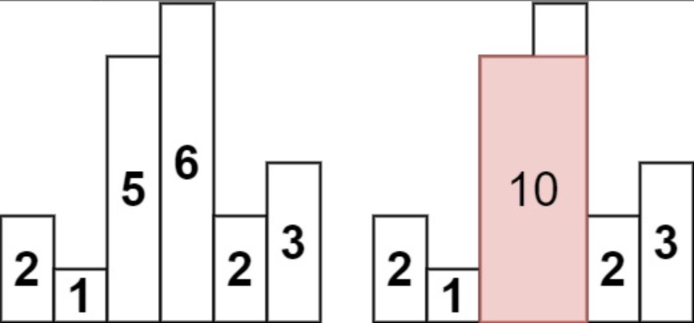

[TOC]

单调栈：栈内的数据是升序或者降序的，常用于解决找某个数左边最近的小数或者大数

## 单调栈模板题

给定一个长度为 N 的整数数列，输出每个数左边第一个比它小的数，如果不存在则输出 −1。

```idl
5
3 4 2 7 5
```

代码：

```cpp
#include <iostream>
#include <stack>
#include <vector>

using namespace std;
vector<int> findLeftMin(vector<int>& nums){
    vector<int> ans;
    stack<int> stk;
    int n = nums.size();
    for(int i = 0; i < n; i++){
        //如果栈内有数据，栈顶元素如果大于当前的数，那么这个数必然不会再用到，可以删除
        while(!stk.empty() && stk.top() >= nums[i]) stk.pop();
        //如果栈顶为空，说明左边没有比nums[i]小的数
        if(stk.empty()) 
            ans.push_back(-1);
        else 
           //如果栈顶不为空，栈顶就是nums[i]小的最近的数
            ans.push_back(stk.top());
        stk.push(nums[i]);
    }
    
    return ans;
}
int main()
{
    int n, x;
    cin >> n;
    vector<int> nums;
    for(int i = 0; i < n; i++){
        scanf("%d", &x);
        nums.push_back(x);
    }
    vector<int> ans = findLeftMin(nums);
    for(auto num : ans) cout << num << " " ;
    return 0;
}

```


## [84. 柱状图中最大的矩形](https://leetcode.cn/problems/largest-rectangle-in-histogram/)

给定 *n* 个非负整数，用来表示柱状图中各个柱子的高度。每个柱子彼此相邻，且宽度为 1 。求在该柱状图中，能够勾勒出来的矩形的最大面积。



思路：单调栈，记录每个元素最近的小于或者大于元素的位置下标。分别记为左右边界。例如高度5的左边界时高度1，右边界是高度6.

直观点：记录一遍左边界，再记录一遍右边界，然后计算面积最大值。

优化一下：对于栈内元素，每个元素的前一个数就是当前元素的右边界，而每次遍历时，如果栈顶元素是小于遍历元素的，那么遍历元素就是栈顶元素的左边界。

```cpp
class Solution {
public:
    int largestRectangleArea(vector<int>& heights) {
        int n = heights.size(), ans = 0;
        stack<int> stk;
        stk.push(-1);//哨兵，stack不能为空
        for(int i = 0; i < n; i++){
            //如果i根柱子大于栈顶，那么i是top的右边界，i的栈内下一个元素就是左边界
            //如果是-1也没问题
            while(stk.top() != -1 && heights[i] < heights[stk.top()]){
                int cur = stk.top();
                stk.pop();
                ans = max(ans, (i - stk.top() - 1) * heights[cur] );
            }
            stk.push(i);
        }
        //最后是右边界无限大，右边没有更小的，那么全都弹出计算
        while(stk.top() != -1){
            int cur = stk.top();
            stk.pop();
            ans = max(ans, heights[cur] * (n - stk.top() - 1));
        }
        return ans;
    }
};
```


## [85. 最大矩形](https://leetcode.cn/problems/maximal-rectangle/)

给定一个仅包含 `0` 和 `1` 、大小为 `rows x cols` 的二维二进制矩阵，找出只包含 `1` 的最大矩形，并返回其面积。


思路：将这道题和上面的柱形图那道题结合起来，是柱形图的变形题。只要将1作为高度，每一行作为柱形图的x轴，遍历一遍行，每次遍历计算每行的柱形图高度，然后调用上面84题的函数，就可以了。

```cpp
class Solution {
public:
   // Helper from LC 84
    int largestRectangleArea(vector<int>& heights) {
        heights.push_back(0);
        int N = heights.size();
        stack<int> stk;
        int maxArea = 0;
        for (int i = 0; i < N; i++) {
            while (!stk.empty() && heights[i] < heights[stk.top()]) {
                auto height = heights[stk.top()];
                stk.pop();
                int width = stk.empty() ? i : i - stk.top() - 1;
                maxArea = max(maxArea, height * width);
            }
            
            stk.push(i);
        }  

        return maxArea;     
    }

    int maximalRectangle(vector<vector<char>>& matrix) {
        if (matrix.empty() or matrix[0].empty()) {
            return 0;
        }

        int maxArea = 0;
        int m = matrix.size();
        int n = matrix[0].size();
        vector<int> heights(n, 0);
        //遍历行
        for (int i = 0; i < m; i++) {
            //对于任意的第i行的所有元素，计算每个柱形高度
            for (int j = 0; j < n; j++) {
                if (matrix[i][j] == '0') {
                    heights[j] = 0;
                } else {
                    heights[j] += 1;
                }
            }
            //传入到之前的84题中求解
            maxArea = max(maxArea, largestRectangleArea(heights));
        }
        return maxArea;
    }
};
```

