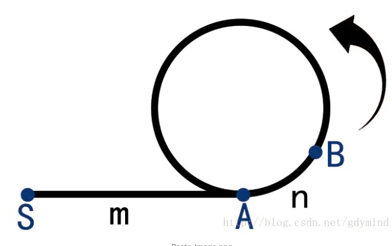
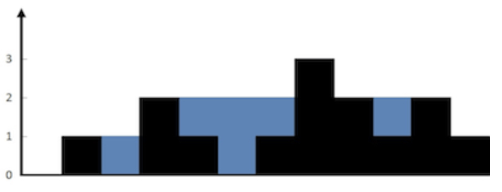

[TOC]

# 判圈算法

## [287. 寻找重复数](https://leetcode.cn/problems/find-the-duplicate-number/)

题目：

给定一个包含 n + 1 个整数的数组 nums ，其数字都在 [1, n] 范围内（包括 1 和 n），可知至少存在一个重复的整数。

假设 nums 只有 一个重复的整数 ，返回 这个重复的数 。

你设计的解决方案必须 不修改 数组 nums 且只用常量级 O(1) 的额外空间。

**示例 1：**

```
输入：nums = [1,3,4,2,2]
输出：2
```

**示例 2：**

```
输入：nums = [3,1,3,4,2]
输出：3
```

来源：力扣（LeetCode）
链接：https://leetcode.cn/problems/find-the-duplicate-number
著作权归领扣网络所有。商业转载请联系官方授权，非商业转载请注明出处。

思路：

- 环形链表的求法，采用快慢指针来做(lc 142题，环形链表)
- 把数组的里面的值作为next指针，那么重复的值就代表了有两个元素的next值相等，这样的话，就相当于链表存在环了。链表环的情况，采用快慢指针就可以解决。
- 复杂度O(n)

代码:

```cpp
class Solution {
public:
    int findDuplicate(vector<int>& nums) {
        int slow = 0, fast = 0;
        while(true){
            slow = nums[slow];
            fast = nums[nums[fast]];
            if(fast == slow) break;
        }
        slow = 0;
        while(true){
            slow = nums[slow];
            fast = nums[fast];
            if(fast == slow) break;
        }
        return slow;
    }
};
```

原理解释：Folyd判圈算法



假设一个有环链表如下图: 利用floyd判圈算法可以做到下面的三件事:

1. 判断是否有环
2. 计算环的长度
3. 寻找环的起点

- 判断是否有环

使用两个指针slow和fast。两个指针都从链表的起始处S开始。slow每次向后移动一步，fast每次向后移动两步。若在fast到达链表尾部前slow与fast相遇了，就说明链表有环。
 这里可以简单的证明一下：反证法，假如没有环，那么slow永远追不上fast，那么在fast到达链表尾部前slow不会fast相遇了。若相遇了，链表就有环。

- 求环的长度

当slow和fast相遇时，slow和fast必定在环上，所以只要让一者不动，另一者走一圈直到相遇，走过的节点数就是环的长度。

- 求环的起点

如图所示，设AB=n, SA=m。设环的长度为L。
 假设slow走过的节点数为i，那么有：
 i = m + n + a * L        a为slow绕过的环的圈数。
 因为fast速度为slow的两倍，所以相同时间走过的节点数为slow的两倍，所以有：
 2*i = m + n + b * L    b为fast绕过的环的圈数。
 两者做差有 : i = (b-a) * L。
 所以可知，fast和slow走过的距离是环的整数倍。
 所以有m+n=L。
 所以此时让slow回到起点S，，fast仍然在B。
 让两个指针以每次一步的速度往前走。
 当走了m步时，可发现slow和fast正好都在A处，即是环的起点。

## [141. 环形链表](https://leetcode.cn/problems/linked-list-cycle/)判断有无环

给你一个链表的头节点 head ，判断链表中是否有环。

如果链表中有某个节点，可以通过连续跟踪 next 指针再次到达，则链表中存在环。 为了表示给定链表中的环，评测系统内部使用整数 pos 来表示链表尾连接到链表中的位置（索引从 0 开始）。注意：pos 不作为参数进行传递 。仅仅是为了标识链表的实际情况。

如果链表中存在环 ，则返回 true 。 否则，返回 false 。

思路：判圈算法，判断是否有环

```cpp
class Solution {
public:
    bool hasCycle(ListNode* head) {
        if (head == nullptr || head->next == nullptr) {
            return false;
        }
        ListNode* slow = head;
        ListNode* fast = head->next;
        while (slow != fast) {
            if (fast == nullptr || fast->next == nullptr) {
                return false;
            }
            slow = slow->next;
            fast = fast->next->next;
        }
        return true;
    }
};
```

## [142. 环形链表 II](https://leetcode.cn/problems/linked-list-cycle-ii/)找环入口

给定一个链表的头节点  head ，返回链表开始入环的第一个节点。 如果链表无环，则返回 null。

如果链表中有某个节点，可以通过连续跟踪 next 指针再次到达，则链表中存在环。 为了表示给定链表中的环，评测系统内部使用整数 pos 来表示链表尾连接到链表中的位置（索引从 0 开始）。如果 pos 是 -1，则在该链表中没有环。注意：pos 不作为参数进行传递，仅仅是为了标识链表的实际情况。

不允许修改 链表。

来源：力扣（LeetCode）
链接：https://leetcode.cn/problems/linked-list-cycle-ii
著作权归领扣网络所有。商业转载请联系官方授权，非商业转载请注明出处。

```cpp
class Solution {
public:
    ListNode *detectCycle(ListNode *head) {
        ListNode* fast = head, *slow = head;
        //第一步，找到相遇点
        while (true) {//这里如果变成fast != slow,初始化后无法进入循环的
            if (fast == nullptr || fast->next == nullptr) return nullptr;
            fast = fast->next->next;
            slow = slow->next;
            if (fast == slow) break;
        }
        //第二步，让slow回到起点
        slow = head;
        //第三步，找到起点位置
        while (slow != fast) {//这个位置必须是slow!=fast，因为考虑尾部直接连到头部的情况,第一次相遇的地方就是入口了
            slow = slow->next;
            fast = fast->next;
        }
        return slow;
    }
};
```

# -

## [11. 盛最多水的容器](https://leetcode.cn/problems/container-with-most-water/)

给定一个长度为 n 的整数数组 height 。有 n 条垂线，第 i 条线的两个端点是 (i, 0) 和 (i, height[i]) 。

找出其中的两条线，使得它们与 x 轴共同构成的容器可以容纳最多的水。

返回容器可以储存的最大水量。


```cpp
class Solution {
public:
    int maxArea(vector<int>& height) {
        int l = 0, r = height.size() - 1;
        int ans = 0;
        while(l <= r){
            ans = max(ans, (r - l) * min(height[r], height[l]));
            if(height[r] > height[l])
                l++;
            else
                r--;
        }
        return ans;
    }
};
```


# N数之和

## 三数之和

排序以后+双指针

关键问题是，怎么样保证不重复，

1. 排序以后，相等的元素相邻，要直接遍历过去，不进入计算
2. 三数之和，只要确定好第一个，后面的元素部分调用两数之和就行，但是注意两数之和的数组范围，不能再用前面已经遍历过的了。

代码：

```cpp
class Solution {
public:
    //两数之和
    vector<vector<int>> twoSum(vector<int>& nums, int start, int target){
        vector<vector<int>> ans;
        int n = nums.size();
        int l = start;
        int r = n - 1;
        while(l < r){
            int sum = nums[l] + nums[r];
            int left = nums[l], right = nums[r];
            if(sum < target){
                while(l < r && nums[l] == left) l++;
            }else if(sum > target){
                while(l < r && nums[r] == right) r--;
            }else{
                ans.emplace_back(vector<int>({left,right}));
                while(l < r && nums[l] == left) l++;
                while(l < r && nums[r] == right) r--;
            }
        }
        return ans;
    }
    //三数之和
    vector<vector<int>> threeSum(vector<int>& nums) {
        sort(nums.begin(), nums.end());
        int n = nums.size();
        vector<vector<int>> ans;
        for(int i = 0; i < n; i ++){
            auto tmpans = twoSum(nums, i + 1, -nums[i]);
            for(auto tmp : tmpans){
                tmp.push_back(nums[i]);
                ans.push_back(tmp);
            }
            while(i < n - 1 && nums[i] == nums[i + 1]) i++;
        }
        return ans;
    }
};
```

# -

## [42. 接雨水](https://leetcode.cn/problems/trapping-rain-water/)

给定 `n` 个非负整数表示每个宽度为 `1` 的柱子的高度图，计算按此排列的柱子，下雨之后能接多少雨水。



思路：

- 需要看局部的结果，针对每个位置i，能存下多少的水量，将每个位置的水量加起来就是能存储的总水量
- 对于每个位置可以储蓄的水量，是min(l_max,r_max) * (1-height[i])，所以问题就在于，对于任意的i，他的l_max和r_max该怎么求？
- 最差的情况是直接暴力求解，优化版是用数组记录，最优版是双指针。

```cpp
class Solution {
public:
    int trap(vector<int>& height) {
        if(height.empty()) return 0;
        int n = height.size();
        int left = 0, right = n - 1;
        int ans = 0;
        //l_max表示：[0...left]这部分里面的最高的柱子
        //r_max表示：[right...n-1]这部分里面的最高的柱子
        int l_max = height[0];
        int r_max = height[n - 1];
      
        while(left <= right){
            //更新
            l_max = max(l_max, height[left]);
            r_max = max(r_max, height[right]);
          //如果右边最高柱子更高，说明左柱子肯定是较小值了,可以以此为短板计算
            if(l_max < r_max){
                ans += l_max - height[left];
                left++;
            }else {
                ans += r_max - height[right];
                right--;
            }
        }
        return ans;
    }
};
```

## [75. 颜色分类](https://leetcode.cn/problems/sort-colors/)

给定一个包含红色、白色和蓝色、共 n 个元素的数组 nums ，原地对它们进行排序，使得相同颜色的元素相邻，并按照红色、白色、蓝色顺序排列。

我们使用整数 0、 1 和 2 分别表示红色、白色和蓝色。

必须在不使用库的sort函数的情况下解决这个问题。

**示例 1：**

```
输入：nums = [2,0,2,1,1,0]
输出：[0,0,1,1,2,2]
```

```cpp
Class Solution {
public:
    void sortColors(vector<int> &nums) {
        int size = nums.size();
        if (size < 2) {
            return;
        }

        //循环不变量
        // all in [0, zero] = 0
        // all in (zero, i) = 1
        // all in (two, len - 1] = 2

        int zero = -1;
        int two = size - 1;
        int i = 0;
        
        while (i <= two) {
            if (nums[i] == 0) {
                zero++;
                swap(nums[zero], nums[i]);
                i++;
            } else if (nums[i] == 1) {
                i++;
            } else {
                swap(nums[i], nums[two]);
                two--;
            }
        }
    }
};
```

## [160. 相交链表](https://leetcode.cn/problems/intersection-of-two-linked-lists/)

给你两个单链表的头节点 `headA` 和 `headB` ，请你找出并返回两个单链表相交的起始节点。如果两个链表不存在相交节点，返回 `null` 。

思路：两个指针，pA先遍历headA，遍历完，再从headB遍历，pB先遍历headB，遍历完从headA开始遍历，这样两者最终会在相交点相遇。

```cpp
class Solution {
public:
    ListNode *getIntersectionNode(ListNode *headA, ListNode *headB) {
        ListNode *pA = headA, *pB = headB;
        while(pA || pB){
            if(!pA) pA = headB;
            if(!pB) pB = headA;
            if(pA == pB) return pA;
            pA = pA->next;
            pB = pB->next;
        }
        return nullptr;
    }
};
```

## [234. 回文链表](https://leetcode.cn/problems/palindrome-linked-list/)

给你一个单链表的头节点 `head` ，请你判断该链表是否为回文链表。如果是，返回 `true` ；否则，返回 `false` 。

```
输入：head = [1,2,2,1]
输出：true
```

代码：

```cpp
class Solution {
public:
    bool isPalindrome(ListNode* head) {
        if(!head || !head->next) return true;
        ListNode* mid = findMid(head);
        auto back = reverselist(mid);
        ListNode* p1 = head;
        ListNode* p2 = back;
        while(p2){
            if(p1->val != p2->val) return false;
            p1 = p1->next;
            p2 = p2->next;
        }

        return true;
    }

    ListNode* findMid(ListNode* head){
        ListNode* fast = head, *slow = head;
        while(fast && fast->next){
            fast = fast->next->next;
            slow = slow->next;
        }
        //偶数
        if(fast == nullptr) return slow;
        return slow->next;
    }

    ListNode* reverselist(ListNode* head){
        ListNode* cur = head;
        ListNode* pre = nullptr;
        while(cur->next){
            ListNode* next = cur->next;
            cur->next = pre;
            pre = cur;
            cur = next; 
        }
        cur->next = pre;
        return cur;
    }
};
```

## [283. 移动零](https://leetcode.cn/problems/move-zeroes/)

给定一个数组 `nums`，编写一个函数将所有 `0` 移动到数组的末尾，同时保持非零元素的相对顺序。

**请注意** ，必须在不复制数组的情况下原地对数组进行操作。

```
输入: nums = [0,1,0,3,12]
输出: [1,3,12,0,0]
```

代码：

```cpp
class Solution {
public:
    void moveZeroes(vector<int>& nums) {
        int slow = 0;
        //slow左边已经处理全非0，中间是0，右边未处理
        //假如nums[slow] != 0,nums[slow] == nums[fast],交换没关系
        //假如nums[slow] == 0,就把0换到了fast的位置
        for(int fast = 0; fast < nums.size(); fast++){
           if(nums[fast] != 0){
               swap(nums[slow++], nums[fast]);
           }
        }
    }
};
```

## [581. 最短无序连续子数组](https://leetcode.cn/problems/shortest-unsorted-continuous-subarray/)

给你一个整数数组 nums ，你需要找出一个 连续子数组 ，如果对这个子数组进行升序排序，那么整个数组都会变为升序排序。

请你找出符合题意的 最短 子数组，并输出它的长度。

 

示例 1：

输入：nums = [2,6,4,8,10,9,15]
输出：5
解释：你只需要对 [6, 4, 8, 10, 9] 进行升序排序，那么整个表都会变为升序排序。

思路：

规律是，把数组分成三段 A、B、C，其中A、C为升序，B是无序的，

对于A：A中的任意i,必有Ai < A [i+1...n-1];同理，对于C的任意i有：C[i] > C[0..i-1]

那么 ，可以维护一个从右到左的最小值min，遍历数组的时候，如果当前值不能更新到min,说明，当前值的右侧有大于当前值的数，找到最后一个满足该条件的当前值，就是无序B的左边界

同理，从右到左，维护一个max，遍历数组时，如果不能更新，那么说明，当前值的左侧，存在比当前值大的元素，找到最后一个满足该条件的当前值，就是无序的右边界。换句话说，这个最后一个当前值的左侧，不存在比他大的数。就是C的那个条件C[i] > C[0..i-1]

```cpp
class Solution {
public:
    int findUnsortedSubarray(vector<int>& nums) {
        int n = nums.size();
        //初始化maxn和minn
        int maxn = INT_MIN, right = -1;
        int minn = INT_MAX, left = -1;
        //开始遍历
        for (int i = 0; i < n; i++) {
            //如果当前不更新最大值的话，就把i赋给右边界
            if (maxn > nums[i]) {
                //说明左侧存在比nums[i]大的元素，更新到最后一定是右边界
                right = i;
            } else {
                maxn = nums[i];
            }
            //从右到左遍历
            if (minn < nums[n - i - 1]) {
                //说明右侧存在比nums[i]小的元素，更新到最后一定是右边界
                left = n - i - 1;
            } else {
                minn = nums[n - i - 1];
            }
        }
        return right == -1 ? 0 : right - left + 1;
    }
};
```

# 回文

## [5. 最长回文子串](https://leetcode.cn/problems/longest-palindromic-substring/)

给你一个字符串 `s`，找到 `s` 中最长的回文子串。

```
输入：s = "babad"
输出："bab"
解释："aba" 同样是符合题意的答案。
```

```cpp
//中心扩展法
class Solution {
public:
    pair<int, int> centerExpand(string &s, int l, int r){
        while(l >= 0 && r < s.size() && s[l] == s[r]){
            l --;
            r ++;
        }
        return {l + 1, r - 1};
    }
    string longestPalindrome(string s) {
        int start = 0, end = 0;
        for(int i = 0; i < s.size(); i++){
            //中心是一个或者两个
            auto [l1, r1] = centerExpand(s, i, i);
            auto [l2, r2] = centerExpand(s, i, i + 1);
            if(r1 - l1 > end - start){
                start = l1;
                end = r1;
            }
            if(r2 - l2 > end - start){
                start = l2;
                end = r2;
            }
        }
        return s.substr(start,  end - start + 1);
    }
};
```

## [647. 回文子串](https://leetcode.cn/problems/palindromic-substrings/)

给你一个字符串 s ，请你统计并返回这个字符串中 回文子串 的数目。

回文字符串 是正着读和倒过来读一样的字符串。

子字符串 是字符串中的由连续字符组成的一个序列。

具有不同开始位置或结束位置的子串，即使是由相同的字符组成，也会被视作不同的子串。

```
输入：s = "abc"
输出：3
解释：三个回文子串: "a", "b", "c"
```

**还是中心扩展法！**

```cpp
class Solution {
public:
    int countSubstrings(string s) {
        int ans = 0;
        for(int i = 0; i < s.size(); i++){
            ans += centerExpand(s, i, i);
            ans += centerExpand(s, i, i + 1);
        }
        return ans;
    }

    int centerExpand(string &s, int l, int r){
        int ans = 0;
        while(l >= 0 && r < s.size() && s[l] == s[r]){
            l --;
            r ++;
            ans++;
        }
        return ans;
    }
};
```

# -

## [32. 最长有效括号](https://leetcode.cn/problems/longest-valid-parentheses/)

给你一个只包含 `'('` 和 `')'` 的字符串，找出最长有效（格式正确且连续）括号子串的长度。

```
输入：s = "(()"
输出：2
解释：最长有效括号子串是 "()"
```

思路：

在此方法中，我们利用两个计数器 left和 right。首先，我们从左到右遍历字符串，对于遇到的每个 ‘(’，我们增加 left 计数器，对于遇到的每个 ‘)’，我们增加 right 计数器。每当 left 计数器与 right 计数器相等时，我们计算当前有效字符串的长度，并且记录目前为止找到的最长子字符串。当 right 计数器比 left 计数器大时，我们将 left 和 
right 计数器同时变回 0。

这样的做法贪心地考虑了以当前字符下标结尾的有效括号长度，每次当右括号数量多于左括号数量的时候之前的字符我们都扔掉不再考虑，重新从下一个字符开始计算，但这样会漏掉一种情况，就是遍历的时候左括号的数量始终大于右括号的数量，即 (() ，这种时候最长有效括号是求不出来的。

解决的方法也很简单，我们只需要从右往左遍历用类似的方法计算即可，只是这个时候判断条件反了过来：

当 left计数器比 right 计数器大时，我们将 left 和 right 计数器同时变回 0。当 left 计数器与 right 计数器相等时，我们计算当前有效字符串的长度，并且记录目前为止找到的最长子字符串

代码：

```cpp
class Solution {
public:
    int longestValidParentheses(string s) {
        int left = 0, right = 0, maxlength = 0;
        for (int i = 0; i < s.length(); i++) {
            if (s[i] == '(') {
                left++;
            } else {
                right++;
            }
            if (left == right) {
                maxlength = max(maxlength, 2 * right);
            } else if (right > left) {
                left = right = 0;
            }
        }
        left = right = 0;
        for (int i = (int)s.length() - 1; i >= 0; i--) {
            if (s[i] == '(') {
                left++;
            } else {
                right++;
            }
            if (left == right) {
                maxlength = max(maxlength, 2 * left);
            } else if (left > right) {
                left = right = 0;
            }
        }
        return maxlength;
    }
};
```

